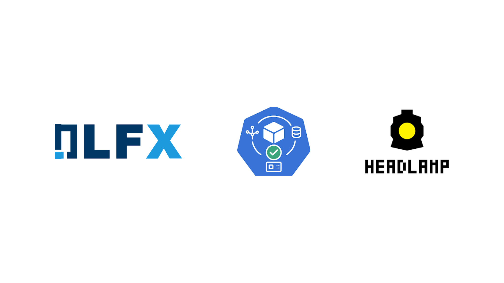
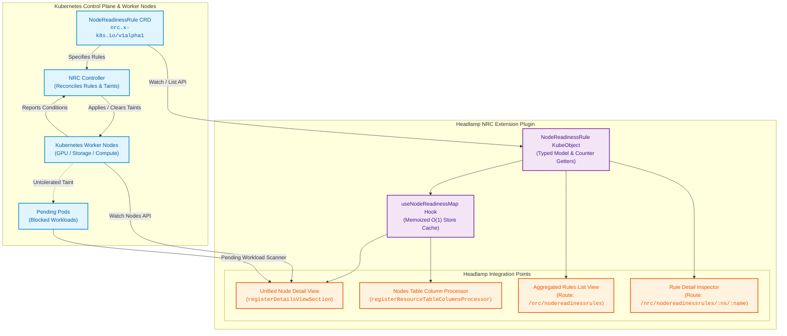

<p align="center">
  
</p>

<h1 align="center">Headlamp Node Readiness Controller (NRC) Plugin</h1>

<p align="center">
  <strong>Declarative node readiness management, real-time condition breakdown, and workload impact analysis integrated natively into Headlamp.</strong>
</p>

<p align="center">
  <a href="https://lfx.linuxfoundation.org/"></a>
  <a href="https://kubernetes.io/"></a>
  <a href="https://headlamp.dev/"></a>
  <a href="https://www.typescriptlang.org/"></a>
  <a href="LICENSE"></a>
</p>

<p align="center">
  <a href="#overview">Overview</a> •
  <a href="#architecture">Architecture</a> •
  <a href="#key-features">Features</a> •
  <a href="#poc-accomplishments">POC Accomplishments</a> •
  <a href="#architectural-decisions-log-adrs">Decisions Made</a> •
  <a href="#quick-start">Quick Start</a> •
  <a href="#development--tooling">Development</a>
</p>

---

## Overview

When provisioning or autoscaling Kubernetes clusters, worker nodes frequently transition to `Ready` status before critical node-level daemons—such as CNI network plugins, CSI storage drivers, GPU initialization scripts, or security monitoring agents—are fully operational. Standard Kubernetes scheduling algorithms may immediately place workload pods onto these partially bootstrapped nodes, causing unexpected pod failures, crash loops, and service disruption.

The **Node Readiness Controller (NRC)** eliminates this race condition by enforcing custom readiness policies. It keeps newly joined or restarting nodes safely tainted (`unschedulable`) until all specified readiness rules are fully satisfied.

The **Headlamp NRC Plugin** seamlessly connects NRC's backend controller with [Headlamp](https://headlamp.dev/), providing platform engineers and cluster operators with a transparent, real-time visual dashboard:

- **In-Place Inspection**: View readiness states, failing conditions, and active NRC taints directly on standard Headlamp Node pages.
- **Workload Impact Scanner**: Instantly identify which pending pods are blocked from scheduling due to held node states.
- **Cluster-Wide Rule Management**: Monitor matched, held, and bootstrap-completed node metrics across all `NodeReadinessRule` CRDs.

> [!NOTE]  
> This project was created under the **Linux Foundation LFX Mentorship Program**, collaborating with the **Kubernetes** organization and **Headlamp** open-source community.

---

## Architecture

The diagram below outlines how `NodeReadinessRule` CRDs, the NRC Controller, and Headlamp's UI extension API interact to deliver zero-latency node readiness visibility.



---

## Key Features

### 1. Unified Node Detail View
Injected directly into standard Headlamp Node details via `registerDetailsViewSection`:
- **Readiness Banners**: Color-coded alerts (`Success`, `Info`, `Warning`, `Error`) summarizing node status.
- **Rule Breakdown Table**: Compares expected condition values against live observed values per rule.
- **Stalled Bootstrap Alerts**: Automatically flags nodes exceeding `spec.timeoutSeconds`.

### 2. Global Nodes List Status Column
Integrated into the main Kubernetes Nodes table via `registerResourceTableColumnsProcessor`:
- Live status chips: `Passed`, `Pending (Bootstrap)`, `Tainted (NRC)`, or `Projected Taint (DryRun)`.
- Non-blocking $O(1)$ memoized lookup per table row.

### 3. Impacted Workload Correlator
- Scans `Pending` pods in the cluster and highlights workloads specifically blocked by untolerated NRC node taints.

### 4. Cluster-Wide Rule Dashboard & Details Inspector
- Dedicated navigation bar item under **Cluster** menu.
- Displays aggregate counters ($O(1)$): **Matched Nodes**, **Held Nodes**, and **Completed Nodes**.
- Deep-dive detail view for inspecting node selectors, timeout settings, and applied node evaluations.

---

## POC Accomplishments

The Proof of Concept (POC) successfully achieved all core functional and architectural objectives:

- [x] **Zero-Core Modifications**: Extended Headlamp purely through plugin APIs (`registerDetailsViewSection`, `registerResourceTableColumnsProcessor`, `registerSidebarEntry`, `registerRoute`).
- [x] **Multi-Enforcement Mode Engine**: Full UI support for `continuous` enforcement, `bootstrap-only` initial readiness, and `dryRun` projection modes.
- [x] **High-Performance Map Caching**: Implemented `useNodeReadinessMap` to parse cluster rules into an $O(1)$ node lookup map once per Redux store update, preventing per-row re-renders on large node pools.
- [x] **Real-Time Workload Correlation**: Built `useImpactedPendingPods` hook to match held nodes with blocked `Pending` workloads.
- [x] **Full Type Safety & Test Readiness**: Complete TypeScript typing with Storybook component stories and Vitest test setup.

---

## Architectural Decisions Log (ADRs)

| ADR # | Decision | Context & Rationale | Outcome |
|:---:|---|---|---|
| **ADR-01** | **In-Place UI Section Injection** | Cluster operators prefer viewing node health on the Node page itself rather than switching to an isolated plugin tab. | Zero context switching; NRC banners render directly on standard Headlamp Node detail views. |
| **ADR-02** | **Memoized Map Store Cache (`useNodeReadinessMap`)** | Re-filtering rules per row in a 500-node table causes heavy re-render lag. | Parsed node evaluation maps are computed once per store update, yielding $O(1)$ cell lookups. |
| **ADR-03** | **$O(1)$ Aggregate Counter Semantics** | Client-side array filtering for large clusters slows down list views. | Model uses top-level status counters (`matchedNodesCount`, `heldNodesCount`, `completedNodesCount`) provided by the controller. |
| **ADR-04** | **First-Class DryRun Projection** | Operators need to test new rules safely before applying active taints. | DryRun mode renders distinct amber "Projected Taint" badges to preview impact without altering pod scheduling. |
| **ADR-05** | **Workload Impact Correlator** | Knowing a node is held is useful, but identifying blocked workloads is actionable. | Added pod status scanner filtering pending pods blocked by untolerated NRC taints. |

---

## Quick Start

### Prerequisites

- Headlamp web UI or desktop app installed.
- Access to a Kubernetes cluster (v1.26+) with `NodeReadinessRule` CRD.

### Installing CRDs & Sample Rules

1. **Apply the CRD**:
   ```bash
   kubectl apply -f crd.yaml
   ```

2. **Apply sample readiness rules**:
   ```bash
   kubectl apply -f sample-rules.yaml
   ```

3. **Sample Rule Manifest (`sample-rules.yaml`)**:
   ```yaml
   apiVersion: nrc.x-k8s.io/v1alpha1
   kind: NodeReadinessRule
   metadata:
     name: cni-and-storage-ready
     namespace: default
   spec:
     enforcementMode: bootstrap-only
     timeoutSeconds: 300
     conditionTypes:
       - NetworkReady
       - VolumePluginReady
     taint:
       key: nrc.x-k8s.io/unschedulable
       effect: NoSchedule
   ```

---

## Development & Tooling

### Workspace Setup

```bash
# Clone repository
git clone https://github.com/Sreejesh06/headlamp-nrc-plugin.git
cd headlamp-nrc-plugin

# Install dependencies
npm install
```

### Available NPM Scripts

| Command | Action |
|---|---|
| `npm start` | Launch local development server with watch mode |
| `npm run build` | Build optimized production bundle to `dist/` |
| `npm run tsc` | Execute TypeScript compiler type check |
| `npm run lint` | Run ESLint check |
| `npm run lint-fix` | Automatically fix ESLint formatting & ordering issues |
| `npm run format` | Format code with Prettier |
| `npm run test` | Execute test suite using Vitest |
| `npm run storybook` | Launch Storybook UI component workbench |
| `npm run i18n` | Extract translatable strings for internationalization |
| `npm run package` | Package plugin into standard `.tgz` distribution tarball |

---

## License

Distributed under the **Apache 2.0 License**. See [`LICENSE`](LICENSE) for details.

